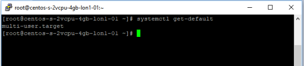
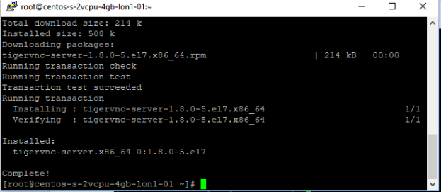
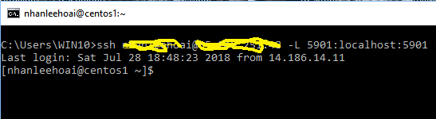
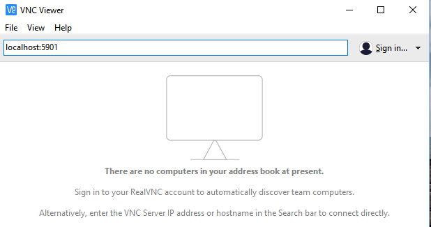

# VNC Viewer thru SSH tunnel

VNC Viewer is one of the most popular tool used to remotely connect to Linux server though is not slow and not secured. One of the way to make the secured connection is to use SSH tunnel. Instead of directly connect to the port 5901 of the remote server, we connect to the port 5901 on the local machine, SSH then forward to the data to the remote server thru the SSH port 22 which is secured


### prerequisites
1. The remote server is CentOS 7.x
2. The local machine is a Windows Box, installed with OpenSSH client, VNC Viewer


### Get started

- Check the server

```
	systemctl get-default
```
 

Muilt-user.target is level 3, which means when the server start up it does not run display manager (such as GNOME)

- Install GNOME 

```
	yum groupinstall -y "GNOME Desktop"
```

it takes a while for the server to download all required packages to install. The time it takes depends on the network bandwidth for downloading.  It takes approximately 3 minutes to download on my digitalOcean droplet.


- Install VNC server on the Centos server

```
	yum install -y tigervnc-server
```


- Add a new user on the Centos server, and change its password. This step is optional. You can use the curent logged-on user for VNC

```
	useradd <USERID>
	passwd <USERID>
	
```

- Create VNC passsword for the user. Note that this password is managed by VNC server and it is different than the Linux server password
Log the user on (can use the "su" command if you are logging as root)

```
	vncpasswd
```


- Configure the VNC connection. This command below is run by roor

```
cp /lib/systemd/system/vncserver@.service  /etc/systemd/system/vncserver@:1.service
```

```
	vim /etc/systemd/system/vncserver@:1.service
```

Edit the file content which suitable USER 

```
[Unit]
Description=Remote desktop service (VNC)
After=syslog.target network.target
[Service]
Type=forking
ExecStartPre=/bin/sh -c '/usr/bin/vncserver -kill %i > /dev/null 2>&1 || :'
ExecStart=/sbin/runuser -l my_user -c "/usr/bin/vncserver %i -geometry 1280x1024"
PIDFile=/home/my_user/.vnc/%H%i.pid
ExecStop=/bin/sh -c '/usr/bin/vncserver -kill %i > /dev/null 2>&1 || :'
[Install]
WantedBy=multi-user.target

```

Now start the VNC server

```
systemctl daemon-reload
systemctl start vncserver@:1
systemctl status vncserver@:1
```

Alternatively for the commands above is to log on as the user with VNC user available (by Putty) and run

```
	vncserver
```

- Back to your Windows box, now run this command line to make SSH tunnel thru port 22 to the Centos server

```
	ssh user@centos-ip -L 5901:localhost:5901 
```

Enter the password (if you want to user SSH key, you can use "-i" parameter to provide the private key file



Keep the command window running (do'nt close it becuase it is responsible for the tunnel)

-  Launch the VNC viewer on the Windows box



Instead of connecting to the port 5901 on the remote Centos server (which is unsecure), you now can connect to the port 5901 on local machine

Key in the password, and congralulation! you are connected!


If the screen resolution is not good as above, which is becuase of the VNC image quality is low. You can change the option to have better resolution screen (of course it consumes more network bandwidth and a bit slowlier


